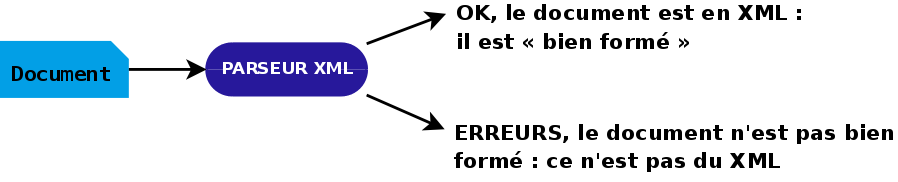

### « Parser » un document XML
-   Les règles XML doivent pouvoir être vérifiées par un programme : le
    **parseur**



-   **Où trouver un parseur ?**
    -   dans les bibliothèques de programmation XML (libxml2, Expat, Xerces, JDOM, SAXON,
        MSXML, …)
    -   dans les navigateurs web (firefox, google-chrome, IE, Edge,
        Safari, Opera, …)
    -   intégrés à des éditeurs XML ;
    -   en « ligne de commande » xmllint, xmlwf,…)

**Remarque :** Dans un programme informatique, « parser » un document
permet :

= soit de charger en mémoire une **structure arborescente d'objets**,
répondant en général à la norme DOM (**parseur DOM**) ;

* soit de parcourir séquentiellement le document afin réaliser certaines
actions lors de l'ouverture ou de la fermeture de balises (**parseur
SAX** ou équivalent).

Dans ces séances, nous utiliserons souvent la commande

```bash
xmllint -noout fichier.xml
```

 pour vérifier que les documents sont bien formés.
