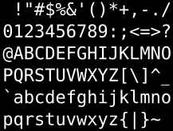

### ASCII : l'ancêtre (1963)

-   ASCII = American Standard Code for
    Information Interchange
-   Encodage sur 7 bits, soit 2 7=128 caractères.

L’encodage [ASCII](http://fr.wikipedia.org/wiki/ASCII#Table_des_128_caract.C3.A8res_ASCII)
