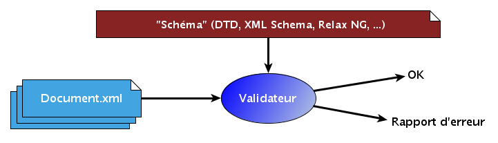

### Processus de validation XML

Un document XML est dit **valide** par rapport à un « schéma » (qui peut
être exprimé sous forme de DTD, de XML Schema, de Schéma RelaxNG, …)
s’il répond aux règles définies dans ce schéma. La **validation** du
document s’effectue à l’aide d’un programme appelé **validateur** :

La validation fait donc intervenir deux documents :

-   le document contenant la description de la structure à respecter
-   le document XML à valider
