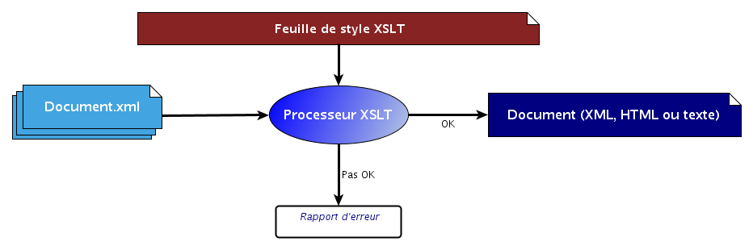

### Processeurs (moteurs) XSLT
Le langage XSLT est mis en oeuvre dans des *processeurs* (on parle aussi
de *moteurs*) XSLT :

#### Où trouver un processeur XSLT ?

-   dans une bibliothèque de programmation XSLT (libxslt, xalan, saxon,
    …), pour différents langages
-   dans des navigateurs web (IE, Firefox,… )
-   Intégré à certains éditeurs XML
-   en ligne de commande (**xsltproc fichier.xsl fichier\_in.xml &gt;
    sortie.xml**)
