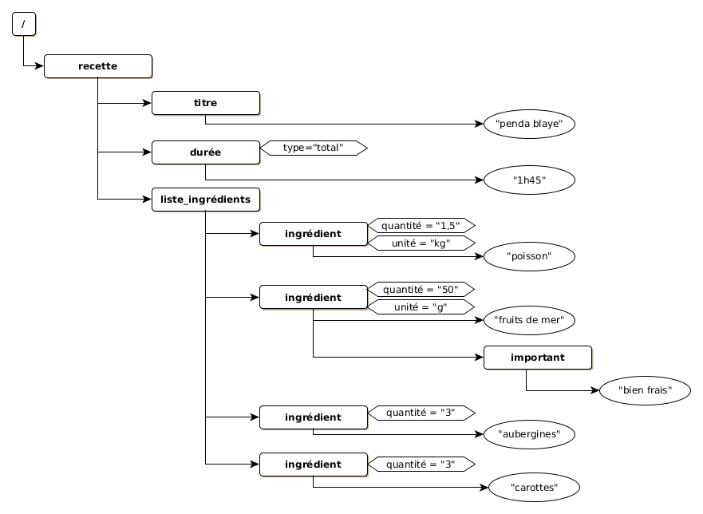
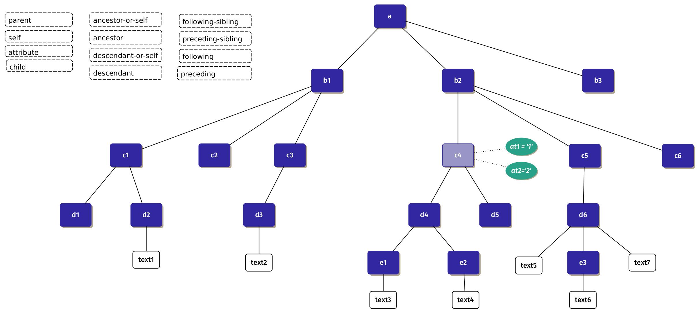

### Exercices sur XPath

#### Préparation

Dans votre espace de travail :
* dans votre répertoire `~/workspace/`, lancez la commande suivante :

    git clone https://github.com/master-defi-xml/examples-xml.git

* créez un répertoire `~/workspace/exercices/` ;
* dans le répertoire `exercices`, créez un répertoire `xpath` ;

##### Représentation arborescente des fichiers d'exemple

